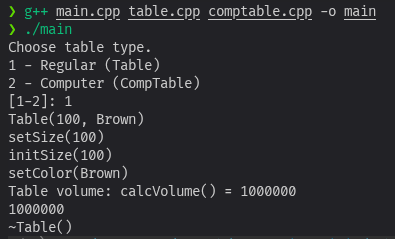
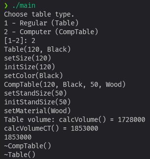
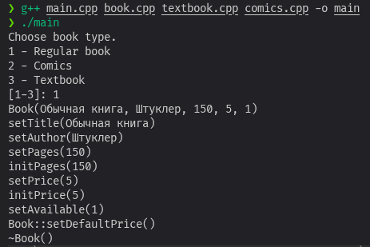
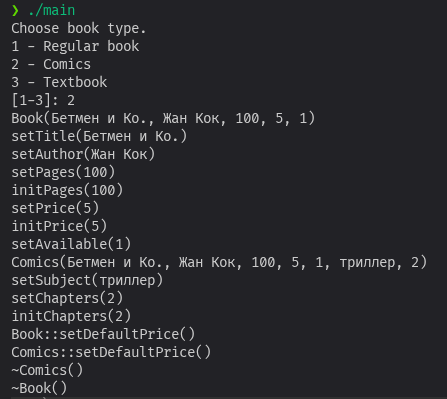
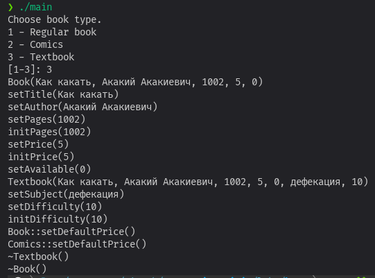

# Лабораторная работа 6

## **Лабораторное задание**

## Постановка задачи

В программе из Лабораторной работы 5 внести изменения:
1.	В родительском классе определить метод вычисления объема, сделать его виртуальным и переопределить в потомке: `int Table::CalcVolume()` и `int CompTable::CalcVolume()`.
2.	В главной программе создавать объекты иерархии классов с помощью механизма позднего связывания: спрашивать у пользователя, объект какого класса иерархии он хочет создать. В главной программе должна объявляться единственная переменная типа класса!
3.	Для корректной работы требуется сделать деструктор виртуальным.

## Компиляция

```bash
g++ main.cpp table.cpp comptable.cpp -o main
```

## Выполнение




-----

## **Домашнее задание**

## Постановка задачи

Внести изменения в Домашнее задание 5:
1.	Для всех классов иерархии переопределить хотя бы один виртуальный метод.
2.	В главной программе с помощью механизма позднего связывания создавать один объект из списка объектов вашей иерархии классов на выбор пользователя.
3.	Для созданного объекта вызывать все полиморфные методы.
4.	Для сравнения создавать по одному объекту для каждого класса иерархии с помощью механизма раннего связывания.

## Описание алгоритма

Был добавлен виртуальный метод setDefaultPrice. В обычной книге цена считается по количеству страниц, а в дочерних классах расчёт стандартной цены дополняется новыми переменными.

## Компиляция

```bash
g++ main.cpp book.cpp textbook.cpp comics.cpp -o main
```

## Выполнение

### Обычная книга

### Комикс

### Учебник
