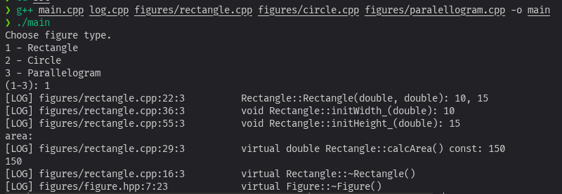
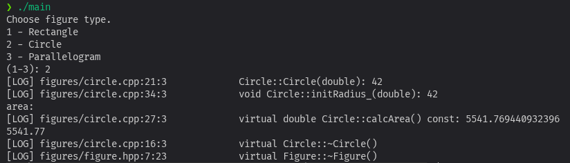
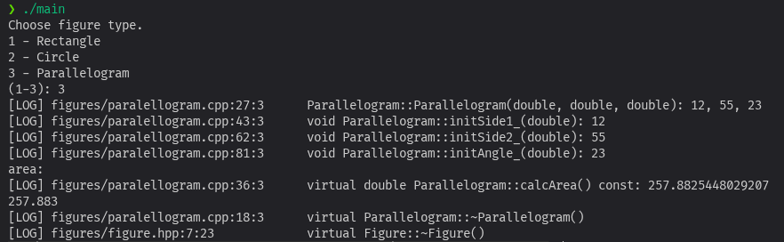

# Лабораторная работа 7

## Постановка задачи

Описать иерархию Фигур:
1.	Базовый класс Фигура ( Figure ). Сделать базовый класс иерархии фигур абстрактным.
2.	Наследники: Круг (Circle), Прямоугольник (Rectangle).
Требования:
1.	Поля всех классов должны быть закрытыми и динамическими.
2.	Для классов иерархии определить метод вычисления площади
double CalcArea();

 В главной программе предоставить пользователю выбор фигуры для создания объекта при помощи позднего связывания. В обязательном порядке выводить на экран всю информацию о созданных объектах и отладочную информацию о вызываемых методах.

Добавить в иерархию классов еще одну фигуру. Переопределить для нее необходимые методы и создавать объекты этого класса.

## Преамбула

Во время написания решения данной лабораторной я очень увлёкся написанием функции логирования. Изучив стандарты c++ я нашёл такую штуку как `std::source_location`. С её помощью можно узнать где именно была вызвана функция логирования, что позволяет не дублировать название метода в `cout` каждый раз. В процессе отладки своей функции логирования я немного разобрался в макросах компилятора (`#define`), развёртывании аргументов через троеточие, и ещё кучу всяких штук перепробовал. В общем занимался чем угодно лишь бы не самой лабой.

## Компиляция

```bash
g++ main.cpp log.cpp figures/rectangle.cpp figures/circle.cpp figures/paralellogram.cpp -o main
```

## Выполнение

### Прямоугольник

### Круг

### Параллелограм
